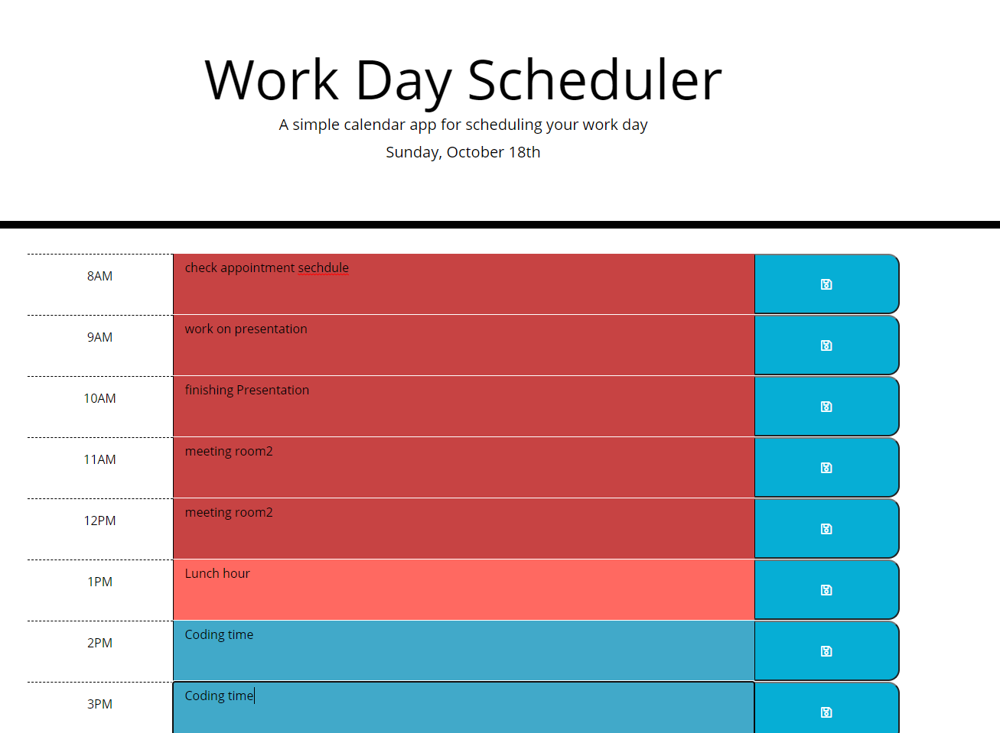
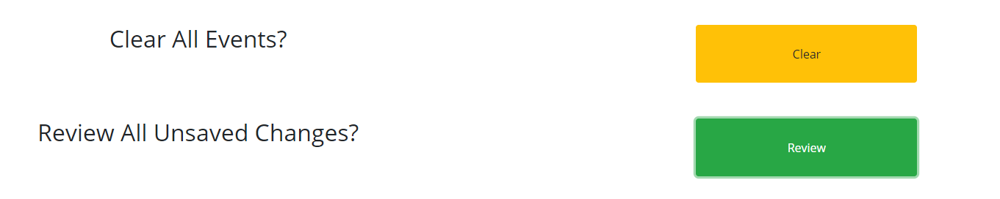

# Daily Planner
The application works as an daily planner.

## Functionality 

The calendar spans a workday from 8AM to 6PM. The current date is displayed at the top of the planner. Each work hour is color-coded based on the current time of day. Hours in the past are red, the present hour is green, and future hours are skyblue.  

### Automatic Reloading of page on the new hour
The page is set to reload on each new hour. Prior to reloading the page, a confirm asks the user if it is okay to reload. This is done in order to prevent unexpected loss of data. If the user confirms, the page reloads displaying the correct colors for each time block and resets the timer to load the page in an hour. If the user denies the reload, they must reload the page to restart this functionality. 

### Event Saving and review
When the user inputs a new event into an hour time block on the planner, user can save the event into local storage by clicking the blue save button to the right of the event.  

When the page is re-visited, saved events are added to the planner from local storage. 

If a previously saved event is deleted and the save button is clicked, the user will be asked to confirm the clearing of the event. 

At the bottom of the planner, users can clear all of the previously saved events with the "Clear" button is pressed.

The user can use reviw button to any unsaveed changes.  

### Link:

https://ikkhan18.github.io/IK-TPAPI-181020/.

### Source code

https://github.com/ikkhan18/IK-TPAPI-181020

